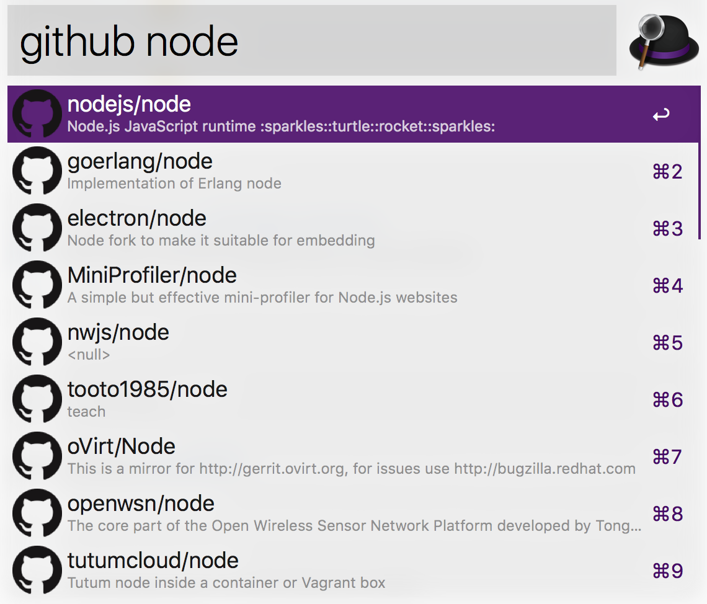

# arvis-github-repo-search

> arvis workflow to find to projects in github



Runs against `api.github.com` without authentication. Too many requests (>10 per minute) will result in **Forbidden** errors.

## Install

```
$ npm install -g arvis-github-repo-search
```

## Usage

In arvis, type `github`, <kbd>Enter</kbd>, and the repo you're looking for.

Select the project you're looking for and open it up in your browser by hitting <kbd>Enter</kbd>.

Hold <kbd>command</kbd> to display the count of Star and Fork.

## License

MIT © [anoff](https://github.com/anoff)

## 🔗 This workflow is converted from [alfred-workflow](https://github.com/anoff/alfred-github).

* Note that there might be some code change or different actions from the original workflow.

* Marked original workflow's creator to author.
